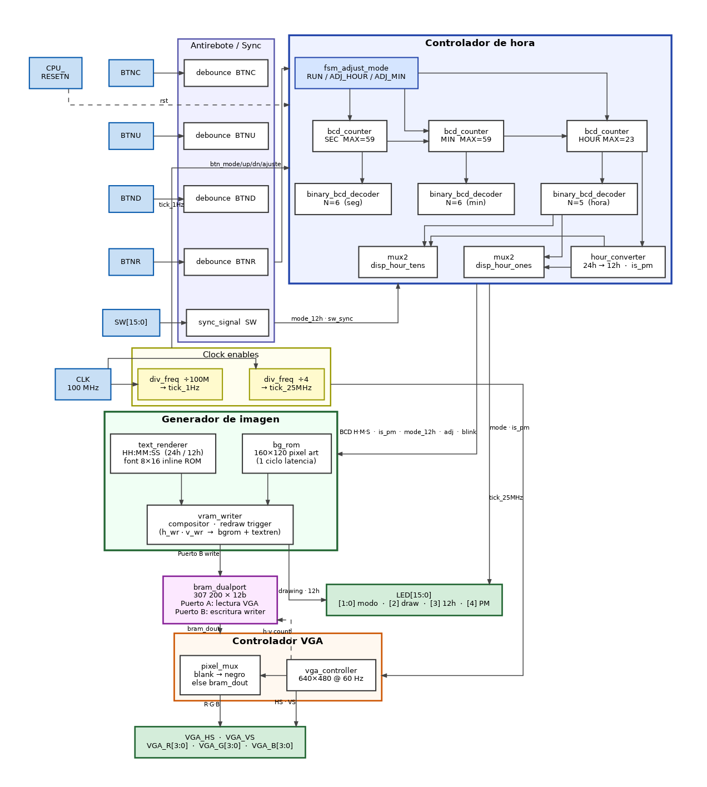

# FPGA Digital Clock — VGA Controller

**Taller de Diseño Digital · Semestre I 2026 · Instituto Tecnológico de Costa Rica**

Implementación de un reloj digital en FPGA con salida VGA, desarrollado sobre la tarjeta **Nexys A7-100T** (Xilinx Artix-7, xc7a100tcsg324-1).

---

## Características

| Característica | Descripción |
|---|---|
| Resolución VGA | 640 × 480 @ 60 Hz |
| Formato de tiempo | 24 h o 12 h (AM/PM) seleccionable por switch |
| Fuente | Pixel-art bold 8 × 16, renderizada a escala 4× (32 × 64 px por carácter) |
| Modos de ajuste | Ajuste manual de horas y minutos mediante botones |
| Parpadeo en ajuste | Dígito seleccionado parpadea a 0.5 Hz sin módulo dedicado |
| VRAM | Dual-port BRAM 12-bit RGB (4-4-4), 640 × 480 = 307 200 píxeles |
| Dominio de reloj | Único: 100 MHz con clock-enables (sin CDC) |

---

## Hardware requerido

- Nexys A7-100T
- Monitor VGA con cable DB-15

---

## Pinout

### Entradas

| Señal | Pin FPGA | IOSTANDARD | Función |
|---|---|---|---|
| `CLK100MHZ` | E3 | LVCMOS33 | Reloj del sistema, 100 MHz |
| `CPU_RESETN` | C12 | LVCMOS33 | Reset general (activo bajo) |
| `BTNC` | N17 | LVCMOS33 | Ciclar modo: RUN → ADJ\_HOUR → ADJ\_MIN → RUN |
| `BTNU` | M18 | LVCMOS33 | Incrementar campo seleccionado |
| `BTND` | P18 | LVCMOS33 | Decrementar campo seleccionado |
| `BTNR` | M17 | LVCMOS33 | Aceptar ajuste y regresar a RUN |
| `SW[0]` | J15 | LVCMOS33 | Modo de display: 0 = 24h, 1 = 12h AM/PM |
| `SW[8]` | T8 | LVCMOS18 | (Banco 34, 1.8 V) |
| `SW[9]` | U8 | LVCMOS18 | (Banco 34, 1.8 V) |

> **Nota:** `SW[8]` y `SW[9]` están en el banco 34 del FPGA que opera a 1.8 V, por eso usan LVCMOS18 en lugar de LVCMOS33.

### Salidas — VGA

| Señal | Pin FPGA | Función |
|---|---|---|
| `VGA_R[3:0]` | A4, C5, B4, A3 | Canal rojo (4 bits) |
| `VGA_G[3:0]` | A6, B6, A5, C6 | Canal verde (4 bits) |
| `VGA_B[3:0]` | D8, D7, C7, B7 | Canal azul (4 bits) |
| `VGA_HS` | B11 | Sincronismo horizontal (activo bajo) |
| `VGA_VS` | B12 | Sincronismo vertical (activo bajo) |

### Salidas — LEDs

| Señal | Pin FPGA | Función |
|---|---|---|
| `LED[1:0]` | K15, H17 | Modo actual: `00`=RUN, `01`=ADJ\_HOUR, `10`=ADJ\_MIN |
| `LED[2]` | J13 | VRAM redibujando (~3 ms por frame) |
| `LED[3]` | N14 | Modo 12 h activo |
| `LED[4]` | R18 | PM activo (solo en modo 12 h) |
| `LED[15:5]` | V11–V17 | Espejo de SW[15:5] |

---

## Diagrama de bloques



---

## Estructura de carpetas

```
fpga_digital_clock_vga_controller/
├── Project_1/
│   ├── Project_1.xpr                          # Proyecto Vivado
│   ├── Project_1.srcs/
│   │   ├── constrs_1/new/
│   │   │   └── nexys_a7_100t.xdc              # Constraints (pinout)
│   │   ├── sources_1/new/
│   │   │   ├── top_vga.v                      # Módulo top (integración)
│   │   │   ├── div_frec.v                     # Divisor de frecuencia
│   │   │   ├── debounce.v                     # Antirrebote de botones
│   │   │   ├── sync_signal.v                  # Sincronizador 2 etapas
│   │   │   ├── fsm_adjust_mode.v              # FSM de ajuste
│   │   │   ├── bcd_counter.v                  # Contador BCD paramétrico
│   │   │   ├── binary_bcd_decoder.v           # Binario → BCD (Double Dabble)
│   │   │   ├── hour_converter.v               # Conversión 24h → 12h
│   │   │   ├── mux2.v                         # Multiplexor 2:1 genérico
│   │   │   ├── vga_controller.v               # Controlador VGA 640×480
│   │   │   ├── text_render.v                  # Renderizador de texto
│   │   │   ├── vram_writer.v                  # Escritor de VRAM
│   │   │   ├── bram_dualport.v                # BRAM dual-port (VRAM)
│   │   │   ├── bg_rom.v                       # ROM de fondo pixel-art
│   │   │   ├── bg_image.mem                   # Datos de la imagen de fondo
│   │   │   ├── pixel_mux.v                    # Mux de salida VGA
│   │   │   ├── bg_generator.v                 # Fondo algorítmico (no instanciado)
│   │   │   ├── bcd_ascii_decoder.v            # BCD → ASCII (no instanciado)
│   │   │   └── rom_bitmap.v                   # ROM de bitmaps (no instanciado)
│   │   └── sim_1/new/
│   │       ├── tb_bcd_counter.v
│   │       ├── tb_binary_bcd_decoder.v
│   │       ├── tb_debounce.v
│   │       ├── tb_div_freq.v
│   │       ├── tb_fsm_adjust_mode.v
│   │       ├── tb_hour_converter.v
│   │       ├── tb_vga_controller.v
│   │       └── tb_integration.v
│   └── Project_1.hw/
│       └── Project_1.lpr
├── scripts/
│   ├── run_sim.sh                             # Ejecuta simulaciones
│   ├── run_pipeline.sh                        # Pipeline completo
│   ├── parse_sim_logs.sh                      # Parsea logs → CSV
│   └── parse_utilization.sh                   # Parsea utilización → CSV
├── sim_results/
│   └── resultados.csv                         # Resultados de testbenches
├── synth_results/
│   └── utilizacion.csv                        # Utilización de recursos
├── generate_docs.py                           # Genera DOCUMENTACION.md
├── DOCUMENTACION.md                           # Documentación técnica autogenerada
├── README.md
└── .gitignore
```

---

## Módulos

| Módulo | Archivo | Descripción |
|---|---|---|
| `top_vga` | `top_vga.v` | Integración raíz, conecta todos los módulos |
| `div_freq` | `div_frec.v` | Divisor de frecuencia genérico (salida pulso) |
| `debounce` | `debounce.v` | Antirrebote con contador de saturación |
| `sync_signal` | `sync_signal.v` | Sincronizador 2-etapas para entradas asíncronas |
| `fsm_adjust_mode` | `fsm_adjust_mode.v` | FSM de ajuste: RUN / ADJ\_HOUR / ADJ\_MIN |
| `bcd_counter` | `bcd_counter.v` | Contador BCD paramétrico (con carry) |
| `binary_bcd_decoder` | `binary_bcd_decoder.v` | Double Dabble: binario → BCD 2 dígitos |
| `hour_converter` | `hour_converter.v` | Conversión 24 h → 12 h BCD + flag AM/PM |
| `mux2` | `mux2.v` | Multiplexor 2:1 genérico parametrizable |
| `vga_controller` | `vga_controller.v` | Generador de señales VGA 640×480@60 Hz |
| `text_renderer` | `text_render.v` | Renderizador combinacional de caracteres |
| `vram_writer` | `vram_writer.v` | FSM que escribe un frame completo en BRAM |
| `bram_dualport` | `bram_dualport.v` | BRAM dual-port inferida (VRAM 12-bit) |
| `bg_rom` | `bg_rom.v` | ROM BRAM con imagen de fondo pixel-art 160×120 |
| `pixel_mux` | `pixel_mux.v` | Mux de salida VGA (blanking + routing RGB) |

---

## Temporización VGA

| Parámetro | Horizontal | Vertical |
|---|---|---|
| Área visible | 640 px | 480 líneas |
| Front porch | 16 px | 10 líneas |
| Sync pulse | 96 px | 2 líneas |
| Back porch | 48 px | 33 líneas |
| **Total** | **800 px** | **525 líneas** |

Pixel clock: 25 MHz (generado como enable de 1 de cada 4 ciclos del reloj de 100 MHz).

---

## Resultados de simulación

Todos los testbenches pasaron sin errores:

| Testbench | Resultado | Errores | Tests fallidos |
|---|---|---|---|
| `tb_bcd_counter` | PASS | 0 | 0 |
| `tb_binary_bcd_decoder` | PASS | 0 | 0 |
| `tb_debounce` | PASS | 0 | 0 |
| `tb_div_freq` | PASS | 0 | 0 |
| `tb_fsm_adjust_mode` | PASS | 0 | 0 |
| `tb_hour_converter` | PASS | 0 | 0 |
| `tb_vga_controller` | PASS | 0 | 0 |

---

## Utilización de recursos (post-síntesis)

| Recurso | Usado | Disponible | Utilización (%) |
|---|---|---|---|
| Slice LUTs | 397 | 63 400 | 0.63% |
| Slice Registers | 387 | 126 800 | 0.31% |
| Block RAM Tile | 132 | 135 | 97.78% |
| DSPs | 1 | 240 | 0.42% |

La BRAM se lleva casi todo porque la VRAM almacena 307 200 píxeles × 12 bits ≈ 3.52 Mbit de los 4.86 Mbit disponibles, más lo que usa `bg_rom` para la imagen de fondo.

---
